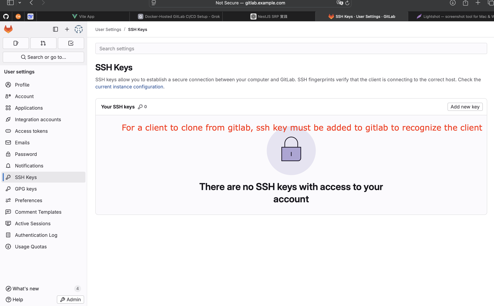
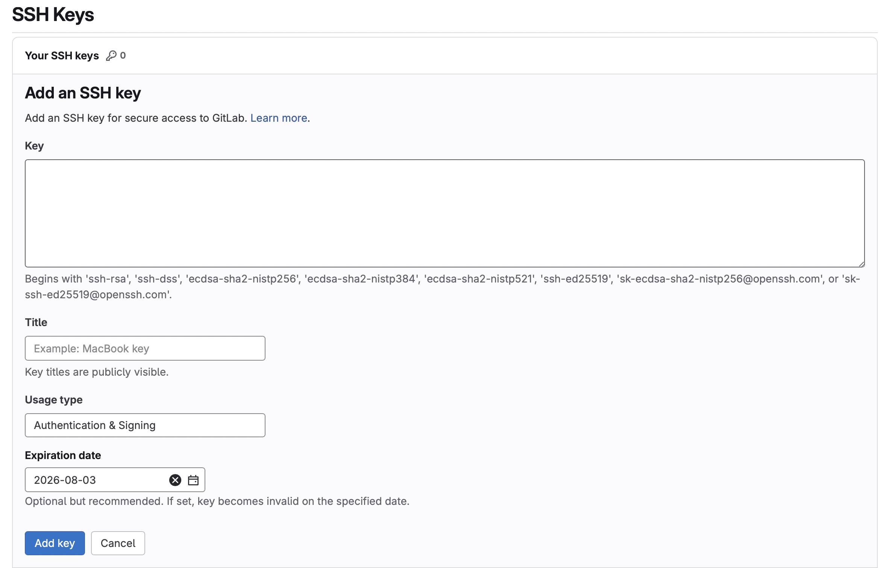
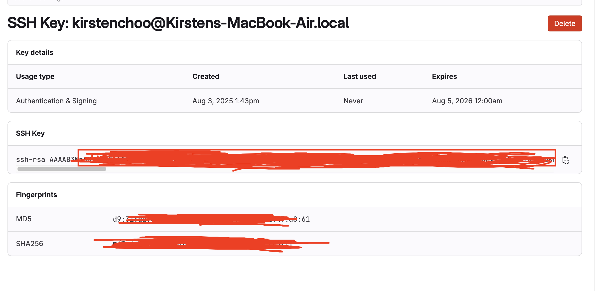
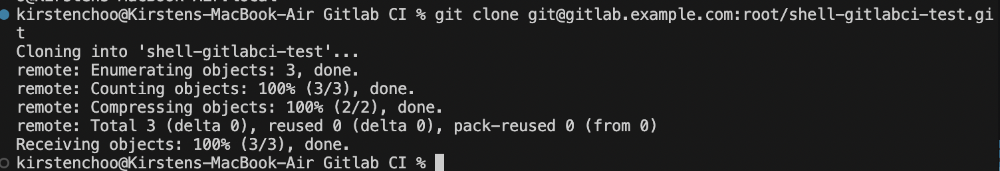
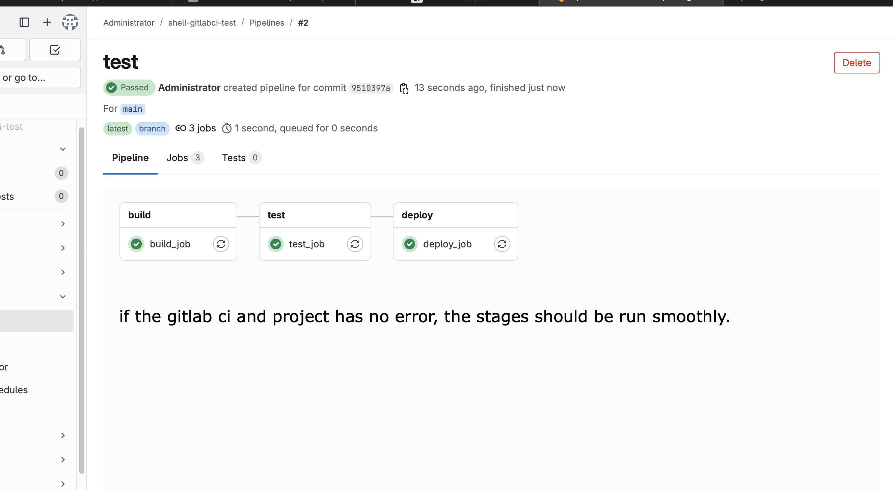
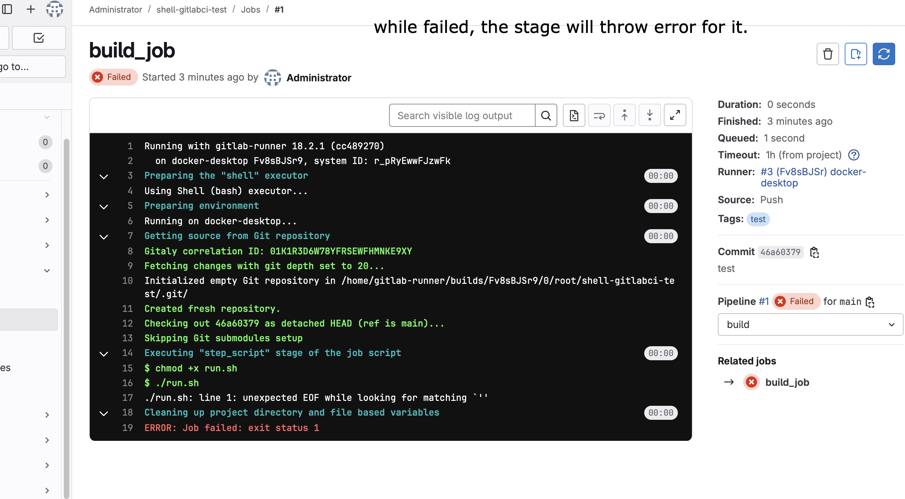
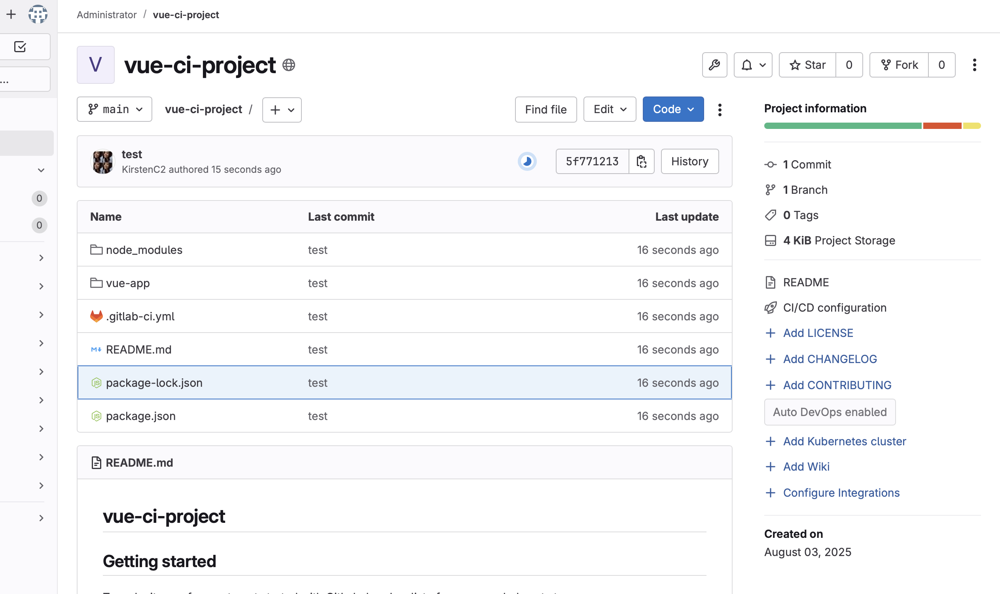

# Gitlab Project Test

## Create a git project

## SSH Key Configuration

First we have to add the client's public key to this gitlab

Fill in below as required.

When the SSH key is being added to Gitlab successfully.

Now your client will be able to clone the project.

After created a sample bash script. push it to the gitlab.

Success case

Failed case

Further on, this can have another feature such as notification, and logging, running npm applications.

based on the runner's executor being chosen.

# Gitlab ci runner for docker
docker exec gitlab-runner gitlab-runner register \
  --non-interactive \
  --url "http://gitlab.example.com" \
  --registration-token "glrt-E6WdhE7yIHmmnZVvNBbOom86MQp0OjEKdToxCw.01.121hrsb3z" \
  --executor "docker" \
  --docker-image "node:18" \
  --description "docker-runner" \
  --tag-list "docker" \
  --run-untagged="true" \
  --locked="false" \
  --docker-volumes "/var/run/docker.sock:/var/run/docker.sock"

For a vue project being pushed to the gitlab sample.

docker exec gitlab-runner gitlab-runner register \
  --non-interactive \
  --url "http://gitlab.example.com" \
  --registration-token "9d3AuhTPy1a8a3jWt9H5" \
  --executor "shell" \
  --docker-image "node:18" \
  --description "shell-runner" \
  --tag-list "shell" \
  --run-untagged="true" \
  --locked="false" \