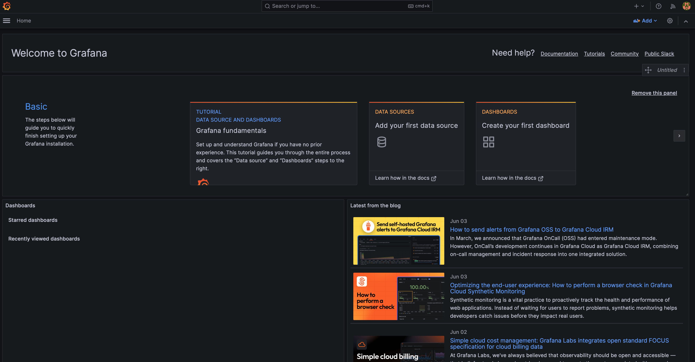
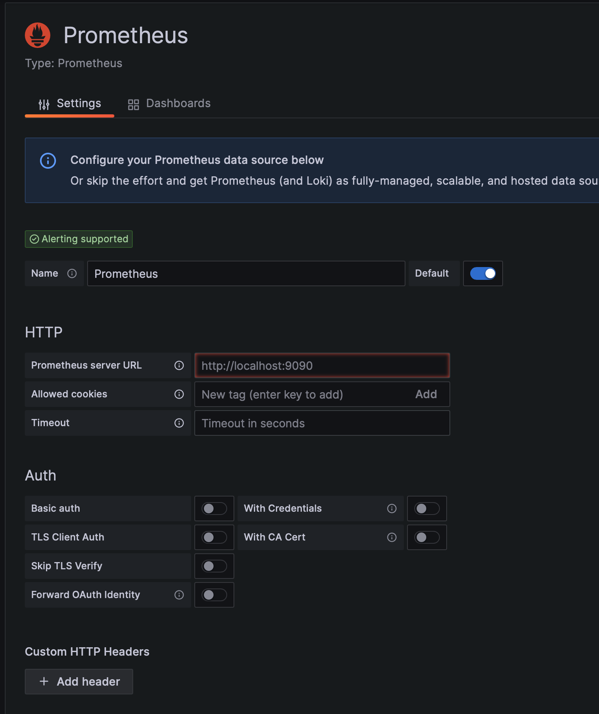

# DevOps Monitoring Stack
For learning purpose.



## Overview

This project sets up a monitoring stack using Docker Compose with the following components:

- **Prometheus**: For metrics collection and storage
- **Grafana**: For metrics visualization and dashboards
- **Sample App**: A containerized application with metrics exposed

## Getting Started

### Prerequisites

- Docker and Docker Compose installed
- Basic understanding of monitoring concepts

### Running the Stack

```bash
# Start the monitoring stack
docker compose up -d

# Check the status of the containers
docker compose ps

# View logs
docker compose logs -f

# Stop the stack
docker compose down
```

## Services and Ports

| Service    | Port | Description                        |
|------------|------|------------------------------------|  
| App        | 8090 | Sample application                 |
| Prometheus | 9090 | Metrics collection and storage     |
| Grafana    | 3001 | Metrics visualization and dashboards |

## Access Information

- **Prometheus**: http://localhost:9090
- **Grafana**: http://localhost:3001 (Username: `admin`, Password: `admin`)
- **Sample App**: http://localhost:8090

## Data Sources

### 1. Prometheus as Data Source



Prometheus is automatically configured as a data source in Grafana. The connection is pre-configured through the provisioning files.

## Configuration Files

- `compose.yaml`: Main Docker Compose configuration
- `prometheus/prometheus.yml`: Prometheus configuration with Docker service discovery
- `grafana/provisioning/`: Grafana provisioning files for datasources and dashboards

## Creating Custom Dashboards

1. Log in to Grafana at http://localhost:3001
2. Click on "+ Create" in the left sidebar and select "Dashboard"
3. Add panels by clicking "Add panel" button
4. Select Prometheus as the data source
5. Use PromQL to query metrics (e.g., `rate(http_requests_total[5m])`)
6. Save your dashboard

## Adding Custom Metrics

### For a Node.js Application

```javascript
const client = require('prom-client');
const register = new client.Registry();

// Create a gauge metric
const gauge = new client.Gauge({
  name: 'my_app_gauge',
  help: 'Example gauge metric',
  registers: [register]
});

// Create a counter metric
const counter = new client.Counter({
  name: 'my_app_counter',
  help: 'Example counter metric',
  registers: [register]
});

// Expose metrics endpoint
app.get('/metrics', async (req, res) => {
  res.set('Content-Type', register.contentType);
  res.end(await register.metrics());
});
```

### For a Python Application

```python
from prometheus_client import Counter, Gauge, start_http_server

# Create metrics
counter = Counter('my_app_counter', 'Example counter metric')
gauge = Gauge('my_app_gauge', 'Example gauge metric')

# Start metrics server
start_http_server(8000)
```

## Advanced Configuration

### Alerting

You can configure alerting in Prometheus by editing the `prometheus.yml` file:

```yaml
alerting:
  alertmanagers:
  - static_configs:
    - targets:
      - alertmanager:9093

rule_files:
  - 'alert_rules.yml'
```

### Scaling

For production environments, consider:

- Using persistent volumes for data storage
- Implementing proper authentication
- Setting up high availability for Prometheus
- Configuring retention policies

## Sample Dashboards

### System Monitoring Dashboard

A sample system monitoring dashboard has been included in this project. It provides visualizations for:

- CPU Usage
- Memory Usage
- Network Traffic
- Disk Usage

This dashboard will be automatically loaded when you start Grafana. You can access it by navigating to the Dashboards section in the Grafana UI.

### macOS Monitoring Dashboard

A dedicated macOS monitoring dashboard is also included, which provides detailed metrics specific to macOS systems:

- macOS CPU Usage
- macOS Memory Usage
- macOS Disk Usage
- macOS Network Traffic
- macOS System Load
- macOS Disk I/O

This dashboard leverages the Node Exporter to collect system metrics from your macOS host.

## Troubleshooting

### Common Issues

1. **Port conflicts**: If you encounter port conflicts, modify the port mappings in the `compose.yaml` file.

   ```yaml
   ports:
     - 3002:3000  # Change 3001 to 3002 if 3001 is already in use
   ```

2. **Permission issues**: If you encounter permission issues with Docker volumes, ensure that the directories have the correct permissions.

   ```bash
   chmod -R 777 ./prometheus
   chmod -R 777 ./grafana
   ```

3. **Prometheus not scraping metrics**: Check the Prometheus targets page at http://localhost:9090/targets to see if all targets are being scraped successfully.

4. **Grafana not showing data**: Verify that the Prometheus data source is correctly configured in Grafana and that Prometheus is successfully collecting metrics.

### Viewing Logs

To view logs for troubleshooting:

```bash
# View logs for all services
docker compose logs

# View logs for a specific service
docker compose logs prometheus
docker compose logs grafana
```

## Further Resources

- [Prometheus Documentation](https://prometheus.io/docs/introduction/overview/)
- [Grafana Documentation](https://grafana.com/docs/)
- [PromQL Query Examples](https://prometheus.io/docs/prometheus/latest/querying/examples/)
- [Grafana Dashboard Examples](https://grafana.com/grafana/dashboards/)
